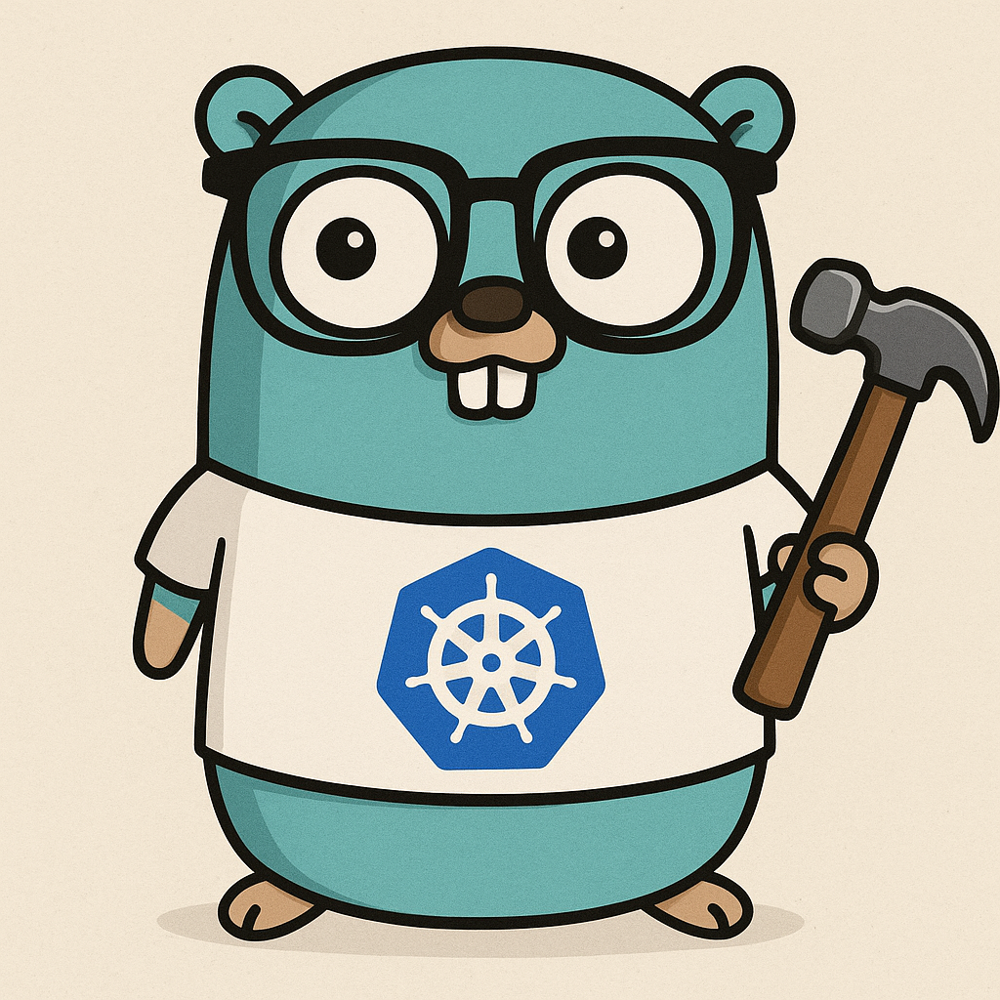

# GikOps Controller

<p align="center">
    <picture width="100">
      <source srcset="docs/assets/img/gikops.png">
      
    </picture>
</p>

GikOps is a tool that allows managing various Kubernetes clusters as well
as the different tools and applications deployed on them.
It enforces the GitOps principle by keeping all configurations in a versioned project.
It is also possible to manage dependencies between tools on a global scale.
The goal of this tool is to enable managing local Kubernetes clusters (development),
pre-production, and production clusters within the same configuration project to
ensure consistency across different clusters while maintaining differences.
It is important to have all the most similar environments possible to avoid
compatibility issues.

## Prerequisites

The following tools must be installed before using the tool:
- kubectl
- git
- helm
- kustomize

The tool will verify these dependencies before running any command.
You can use command `gikopsctl check` to verify dependencies and versions.

## Features

- **Kind Kubernetes local environment**: Helper to install and manage local Kind 
    Cluster from boilerplate.
- **Project Configuration**: Organize and manage your project configuration.
	+ Create, Update, Delete, and Apply project configurations.
	+ Support for cluster management and environment setup.
- **Component Management**: Manage your Kubernetes components with ease.
  + Create, Update, Delete, and Apply component configurations.
  + Support for Helm, Kustomize, and CRD files.
- **Post-initialization or deployement processing** :
  + Several hooks during Helm init process (uploads, resolves, renames, concat).
  + Shell scripts execution during deployement phases. (before, after).
- **Automatic tool verification**: Check external tools versions or alternatives.
- **Shell Completion**: Get seamless completion for `gikopsctl` commands in your shell.

## Summary

- [Installation](#installation)
- [Commands](./docs/CMDS.md)
- [Config Files](./docs/CONFIG_FILES.md)

## Installation

```bash
go install github.com/sh31k30ps/gikops
```

<a id="shell-completion"></a>

### Shell Completion

Generate shell completion scripts for:

```bash
# Bash
gikopsctl completion bash > /etc/bash_completion.d/gikopsctl

# Zsh
gikopsctl completion zsh > "${fpath[1]}/_gikopsctl"

# Oh My Zsh
gikopsctl completion zsh > "~/.oh-my-zsh/custom/completions/_gikopsctl"

# Fish
gikopsctl completion fish > ~/.config/fish/completions/gikopsctl.fish

# PowerShell
gikopsctl completion powershell > gikopsctl.ps1
```

For detailed installation instructions for each shell, run:
```bash
gikopsctl completion --help
```

### Shell alias 

For better efficiancy, you can add in your shell config file those alias:

```bash
alias gok="gikopsctl"
alias gop="gikopsctl project"
alias gocu="gikopsctl cluster"
alias goco="gikopsctl component"
```

## Usage


## Contributing

Please see the [CONTRIBUTING.md](CONTRIBUTING.md) file for
information on how to contribute to this project.

## License

This project is licensed under the GNU AFFERO GENERAL PUBLIC LICENSE (AGPL-3.0-or-later).
See the `LICENSE` file for details.
